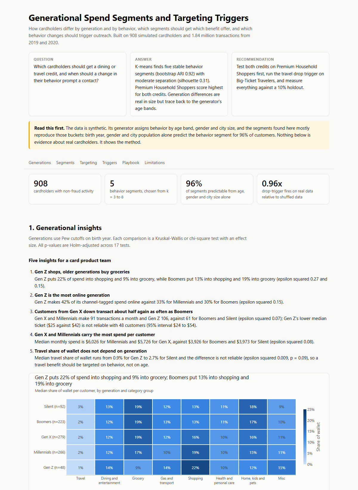
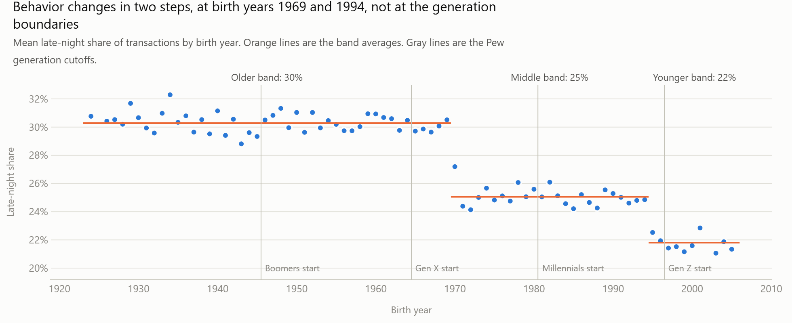
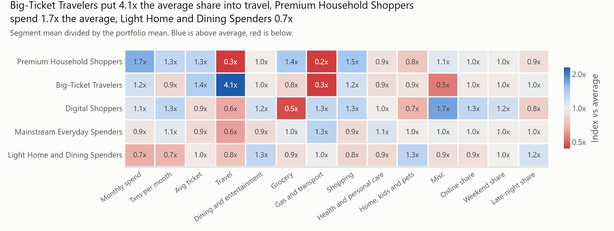
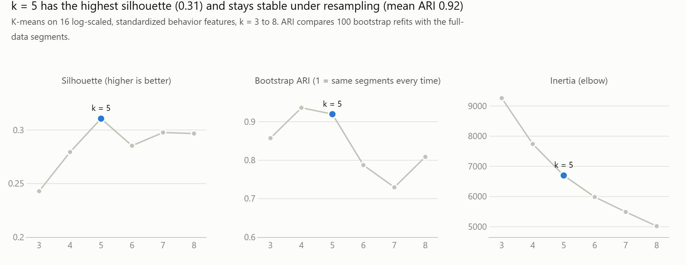
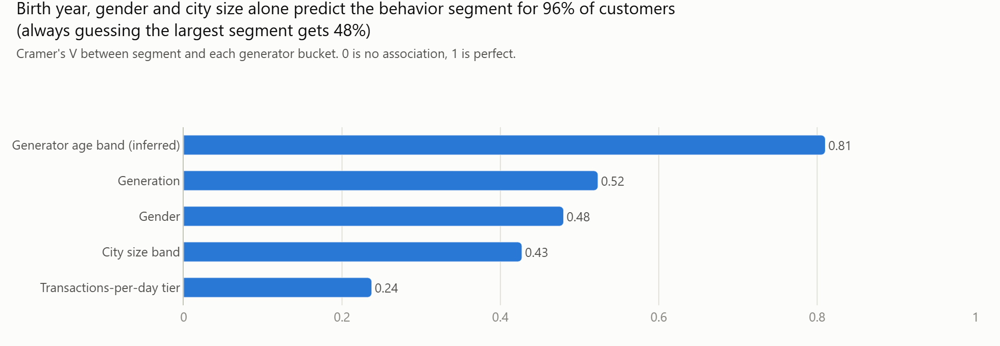
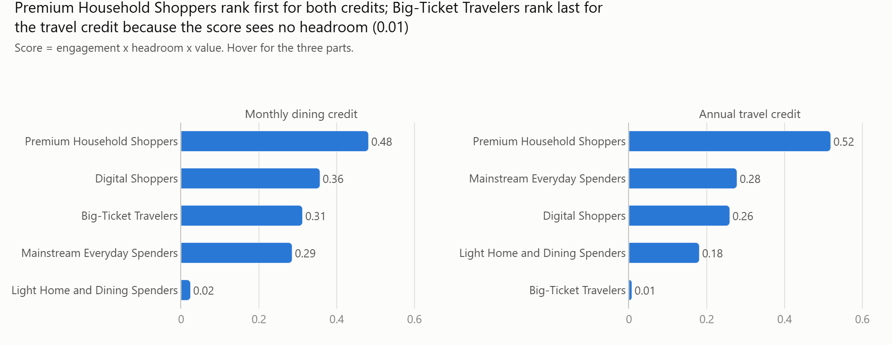
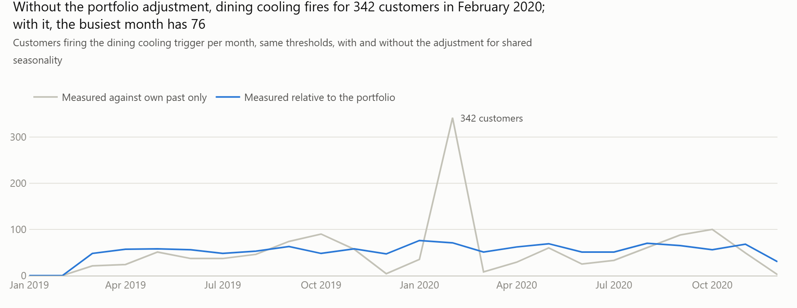
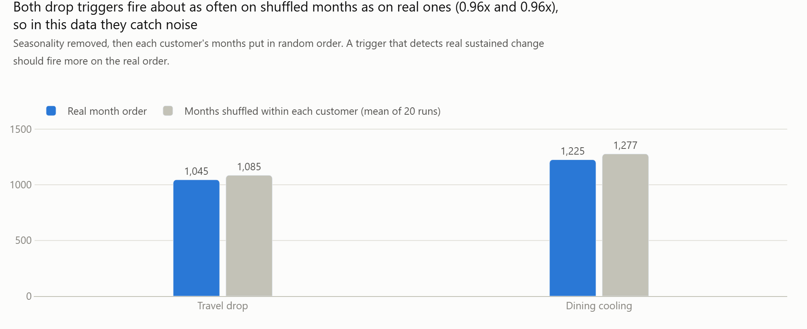
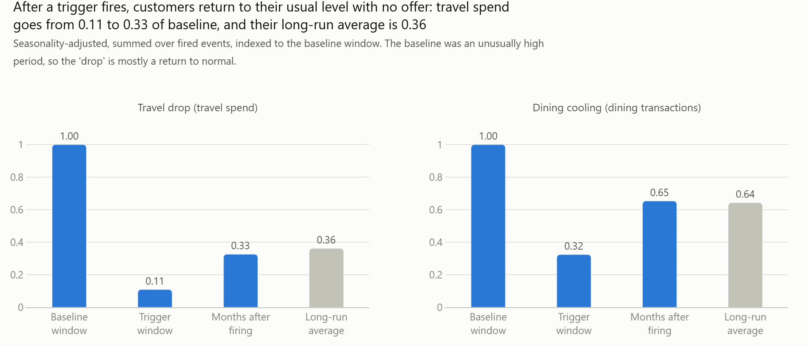

# Generational Spend Segments and Targeting Triggers

**Question.** How do cardholders differ by generation and by behavior, which segments should get which benefit offer, and which behavior changes should trigger outreach?

**Answer.** Five behavior segments hold up under resampling (bootstrap ARI 0.92, silhouette 0.31), and one of them, Premium Household Shoppers (13% of customers, 21% of spend), scores highest for both a dining credit and a travel credit. The generational differences are large on paper but trace back to two age steps built into the simulated data.

**Recommendation.** Test both credits on Premium Household Shoppers first, use the travel-drop trigger to defend Big-Ticket Travelers, and judge every offer against a 10% randomized holdout, because triggered customers recover on their own.

    

**Read the results:** [interactive report](docs/index.html) (GitHub Pages serves it from `/docs`) · [executed notebook](notebooks/analysis.ipynb) · [one-page targeting playbook](docs/targeting_playbook.md) · [data profile](docs/data_profile.md)



## Why this project

It is a portfolio project aimed at a consumer card analytics role, where the work is to build generational behavior insights, design customer segmentation, and define targeting rules and triggers. It covers that loop end to end on 1.84 million simulated card transactions: SQL feature engineering, statistical comparison, clustering, a targeting score, backtested triggers and a test plan to measure lift.

The part I would point a reviewer to is not the segmentation. It is the checking. The data comes from a simulator, so I tested whether each result was a finding or an artifact, and wrote down the answer each time.

## Results at a glance

| Step | Result | Evidence |
|---|---|---|
| Data | 1,852,394 rows combined, 9,651 fraud rows removed, 908 customers, 24 months | [data_profile.md](docs/data_profile.md) |
| Features | 38 per-customer columns built in DuckDB SQL, including `LAG` trends | [sql/](sql), [customer_features.parquet](outputs/customer_features.parquet) |
| Generations | 17 tests with effect sizes. Largest wallet effect: shopping share, epsilon squared 0.27 | [generation_tests.csv](outputs/generation_tests.csv) |
| Artifact check | Inside a generator age band, the generation effect falls to 0.003 | [generation_insights.json](outputs/generation_insights.json) |
| Segmentation | k = 5, silhouette 0.31, bootstrap ARI 0.92, Gaussian mixture agreement 0.95 | [k_selection.csv](outputs/k_selection.csv) |
| Generator check | Age, gender and city size alone predict the segment for 96% of customers (baseline 48%) | [generator_check.json](outputs/generator_check.json) |
| Targeting | Premium Household Shoppers rank first for both credits (scores 0.48 and 0.52) | [targeting_scores.csv](outputs/targeting_scores.csv) |
| Triggers | 1,029 travel-drop, 26 first-travel and 1,256 dining-cooling fires over two years | [trigger_summary.csv](outputs/trigger_summary.csv) |
| Trigger validity | Drop triggers fire 0.96x as often on real data as on shuffled data | [trigger_placebo_test.csv](outputs/trigger_placebo_test.csv) |
| Test plan | 10% holdout. Dining cooling can detect a 22% lift at this volume, travel drop only 91% | [trigger_holdout_design.csv](outputs/trigger_holdout_design.csv) |
| Quality | 49 automated tests on the feature and trigger SQL. Full rebuild from raw in about 2 minutes | [tests/](tests), [run_all.py](run_all.py) |

Every number in this README is written by `run_all.py` into `outputs/` and can be reproduced from the raw files.

## Five generational insights

1. **Gen Z shops, older generations buy groceries.** Gen Z puts 22% of spend into shopping and 9% into grocery. Boomers put 13% into shopping and 19% into grocery (epsilon squared 0.27 and 0.15).
2. **Gen Z is the most online generation.** 42% of its channel-tagged spend is online, against 33% for Millennials and 30% for Boomers (epsilon squared 0.15).
3. **Gen X and younger transact about half again as often as Boomers.** 91 transactions a month for Gen X and Millennials and 106 for Gen Z, against 61 for Boomers and Silent (epsilon squared 0.07).
4. **Gen X and Millennials carry the most spend per customer.** Median monthly spend is $6,026 for Millennials and $5,726 for Gen X, against $3,926 for Boomers (epsilon squared 0.08).
5. **Travel share of wallet does not depend on generation.** The difference is not reliable (epsilon squared 0.009, p = 0.09), so a travel benefit should be targeted on behavior, not on age.

**The caveat that matters.** These are not generation effects. Behavior in this data steps at birth years 1969 and 1994, which are the simulator's age bands, not the Pew cutoffs. Silent and Boomers behave the same, and Gen X is split across two bands.



## Five behavior segments

K-means on 16 behavior features (spend, frequency, ticket, share of wallet across 8 category groups, online share, weekend and late-night share, volatility) after log1p and standard scaling. Age, gender and city size were kept out of the clustering so they could be used to test it.

| Segment | Customers | Share of spend | Monthly spend | What defines it |
|---|---|---|---|---|
| Premium Household Shoppers | 114 (13%) | 21% | $9,510 | Highest spend. Grocery and shopping heavy, almost no travel or gas |
| Big-Ticket Travelers | 102 (11%) | 13% | $6,699 | Travel is 20% of wallet, 4.1x the average. Highest average ticket ($93) |
| Digital Shoppers | 60 (7%) | 7% | $6,304 | 42% online, 108 transactions a month, 80% Gen Z |
| Mainstream Everyday Spenders | 438 (48%) | 45% | $5,306 | Average on most things. Gas and grocery lead |
| Light Home and Dining Spenders | 194 (21%) | 14% | $3,736 | Lowest spend and frequency. Home, kids and pets and dining over-index |





**Do the segments just reproduce the simulator's buckets? Mostly yes.** A model given only birth year, gender and city population predicts the behavior segment for 96% of customers, although none of those were clustering inputs. In a real portfolio that would mean the behavior segments add little beyond a demographic cut. Here it means the clustering correctly recovered the profiles the simulator was built from.



## Who gets which benefit

`score = engagement x headroom x value`, for a monthly dining credit and an annual travel credit. Engagement is how often the segment already makes a qualifying purchase, headroom is the room left to grow category share of wallet, and value is spend relative to the top segment. The formula and seven stated weaknesses are in the [report](docs/index.html) and in [`src/targeting.py`](src/targeting.py).



Big-Ticket Travelers rank last for the travel credit because the score measures room to grow and they have none. For them a travel offer is a retention tool, which is what the travel-drop trigger is for.

## Three triggers, backtested monthly

| Trigger | Rule | Fires | Customers | Spend at stake |
|---|---|---|---|---|
| Travel drop | 3-month travel spend down more than 50% against the prior 3 months, relative to the portfolio, from a base of at least $200 | 1,029 | 647 | $2,692,397 |
| First travel | First-ever travel transaction after at least 3 months with none | 26 | 26 | $2,147 |
| Dining cooling | Dining transaction count down two months in a row relative to the portfolio, from a base of at least 4, total fall of 50% or more | 1,256 | 721 | $394,889 |

Three things the backtest taught me:

**1. A naive rule would have been a false alarm.** Every simulated customer shares the same seasonality, with December at 1.84x an average month. Measured only against a customer's own past, dining cooling fires for 342 customers in February 2020. Measured relative to the portfolio, the busiest month has 76.



**2. In this data the drop triggers catch noise.** I shuffled each customer's months into random order and re-ran the rules. They fired just as often (0.96x). The simulator has no customers whose behavior really changes, so the backtest validates the mechanics and the volume, not the usefulness.



**3. Triggered customers recover with no offer.** Customers who fire were coming off an unusually high period and return to their usual level on their own. A before-and-after comparison would credit the offer with that recovery. This is why each trigger ships with a randomized 10% holdout, an offer, a channel and a success metric in the [playbook](docs/targeting_playbook.md).



## Method

1. **Profile.** Row counts, date range, customers, categories and spend distributions, plus five properties of the data a real portfolio would not have.
2. **Generations.** Pew cutoffs on birth year: Silent before 1946, Boomers 1946 to 1964, Gen X 1965 to 1980, Millennials 1981 to 1996, Gen Z 1997 onward.
3. **Features in SQL.** DuckDB builds RFM, average ticket, share of wallet, online share, weekend and late-night share, spend volatility, and quarter-over-quarter and year-over-year trends with `LAG`.
4. **Generational comparison.** Kruskal-Wallis and chi-square tests with epsilon squared and Cramer's V, Holm-adjusted p-values, bootstrap intervals for medians, and a within-age-band test for the simulator artifact.
5. **Segmentation.** K-means for k = 3 to 8. k chosen on silhouette, elbow, bootstrap stability (adjusted Rand index over 100 resamples) and interpretability, then compared with a Gaussian mixture.
6. **Targeting.** A transparent three-term score, with its weaknesses listed next to it.
7. **Triggers.** Three SQL rules with a portfolio adjustment and a cooldown, backtested monthly for volume, spend at stake and overlap, then checked with a placebo test and a follow-up analysis. Holdout design includes the smallest detectable lift.

## How to run

Requires Python 3.11 and a Kaggle API token (`~/.kaggle/kaggle.json`, or the `KAGGLE_USERNAME` and `KAGGLE_KEY` environment variables).

```bash
python -m venv .venv
.venv\Scripts\activate          # macOS or Linux: source .venv/bin/activate
pip install -r requirements.txt

python run_all.py --clean       # download, rebuild everything from raw, run the tests
pytest                          # tests only
```

`run_all.py` downloads the two CSV files into `data/raw/` (git-ignored), rebuilds the DuckDB database, every file in `outputs/`, the report, the playbook, the data profile and the executed notebook, then runs the tests.

## Repository layout

```
sql/          6 SQL files: load, clean, monthly and quarterly tables, features, triggers
src/          pipeline modules (features, generations, segmentation, targeting, triggers, charts, report)
tests/        49 tests that run the real SQL on small hand-built data
notebooks/    analysis.ipynb, executed with outputs saved
outputs/      every result as CSV, JSON or parquet
docs/         index.html (interactive report), targeting_playbook.md, data_profile.md, images
run_all.py    one command to rebuild from raw data
PLAN.md       the plan written before any code
```

## Limitations

- **Synthetic data.** The transactions come from the Sparkov simulator. Customers never churn, join or change behavior, and all of them share one seasonal pattern. Nothing here is evidence about real cardholders.
- **Segments mirror the simulator's profiles.** They are 96% predictable from age, gender and city size.
- **Generation effects are age-band effects.** Inside a band the effect is negligible.
- **Small sample.** 908 customers, of which 48 are Gen Z and 60 are Digital Shoppers. Intervals for those groups are wide.
- **Triggers fire at the noise rate** in this data, and "spend at stake" is a gap against an expected level, not recoverable money.
- **No response or profit data.** There are no offers, redemptions, fees, rewards costs or credit losses, so the targeting score is a hypothesis and lift can only be measured with the holdout test described in the playbook.
- **Partial channel view.** Only grocery, shopping and misc carry an online or in-store tag.

## Data

Kaggle [`kartik2112/fraud-detection`](https://www.kaggle.com/datasets/kartik2112/fraud-detection), licensed CC0. Fraud transactions (`is_fraud = 1`) are excluded from all behavior analysis.
